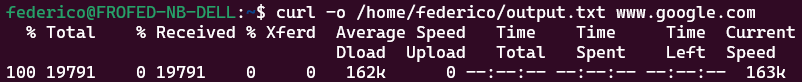

## curl

[curl](https://curl.se/docs/manpage.html#-v) è uno strumento multipiattaforma per trasferire dati da o verso un server ed è progettato per funzionare senza interazione dell'utente. Offre una miriade di funzionalità utili come il supporto per proxy, l'autenticazione dell'utente, il caricamento FTP, HTTP post, le connessioni SSL, i cookie, il ripristino del trasferimento di file.

- `curl <url>` stampa il contenuto dell'url passato come argomento. Puoi aggiungere `-o <file>` se al posto di stdout vuoi lo scarichi e salvi in uno specifico file (nel qual caso a schermo vedi statistiche sulla connessione). Il protocollo di default è HTTP.



**NOTA**: puoi utilizzare l'opzione `-o` per scaricare ogni genere di file (o `-O` per preservare il nome del file). Se ad esempio voglio scaricare una specifica iso ubuntu posso fare:

`curl -O http://ubuntu.mirror.ac.ke/ubuntu-release/18.04.2/ubuntu-18.04.2-desktop-amd64.iso`

- `curl -L <url>` segue le redirezioni.
- `curl -I <url>` ti va a prendere solo gli header. Può essere utile per ottenere informazioni ad esempio sul server o i cookies.
- `curl -v <url>` ti mostra tutto il TLS handshake. È l'opzione verbosa. Mettere più *v* non ha effetto.
- `curl --data {{'name=federico'}} <url>` ti permette di inviare dati che accompagnano la richiesta. Di default fa una HTTP GET. Se ad esempio vogliamo fare una POST:

```
 curl --data {{'{"name":"federico"}'}} --header {{'Content-Type: application/json'}} {{http://example.com/users/1234}}
```