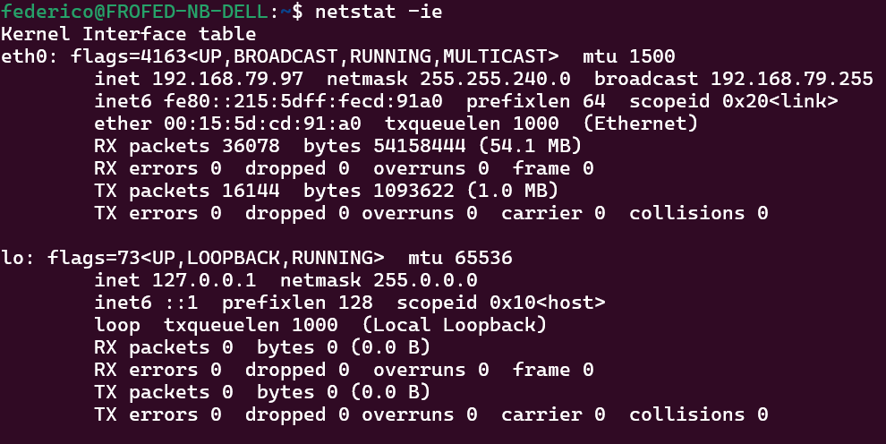
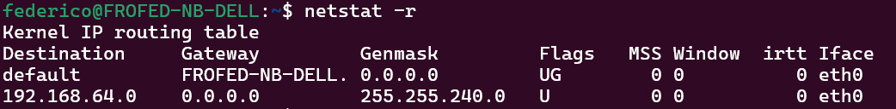

## Netstat

`netstat` è un'utilità di rete da riga di comando che visualizza le connessioni di rete per i protocolli TCP e UDP, le tabelle di routing e una serie di statistiche su interfacce e protocolli di rete.

- `netstat -ie` ti mostra le informazioni sulle interfacce di rete, sia fisiche che virtuali. È simile a quelle che ti mostrerebbe `ifconfig` o `ip address show`. Ad esempio:

- `netsat -r` ti mostra le routing tables da cui posso recuperare ad esempio il gateway delle interfacce attive. Vedo ad esempio qui sotto che ho una interfaccia fisica attiva, nessuna interfaccia virtuale e il mio gateway.

- `netstat -c` rimane in ascolto e stampa le connessioni attive. 
- `netstat -a` stampa tutti i socket attivi. Puoi aggiungere il protocollo (`-u` per udp o `-t` per tcp) ma naturalmente per i socket udp non vedi lo stato della connessione essendo un protocollo *connectionless*. 
- `netstat -l` ti mostra i socket tcp in ascolto. Utile se vogliamo sapere che porte stanno ascoltando sulla nostra macchina. Puoi controllare i socket udp in ascolto aggiungendo `-u`. Nota che non è lo stesso che fare `netstat -a | grep LISTEN` perché ad esempio per SNMP le porte 161 e 162 sono in ascolto con udp.
- `netstat -p` ti mostra il PID e il nome del programma.
- `netstat -n` non risolve i nomi di porte, hosts e utenti. 

Conviene fare un grep dell'output o aggiungere altri parametri per filtrare ulteriormente. 