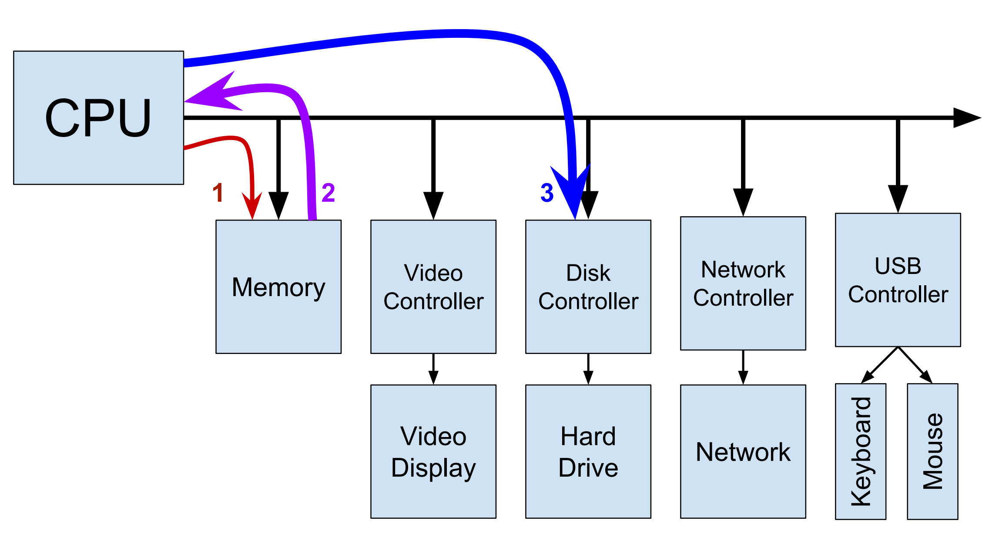
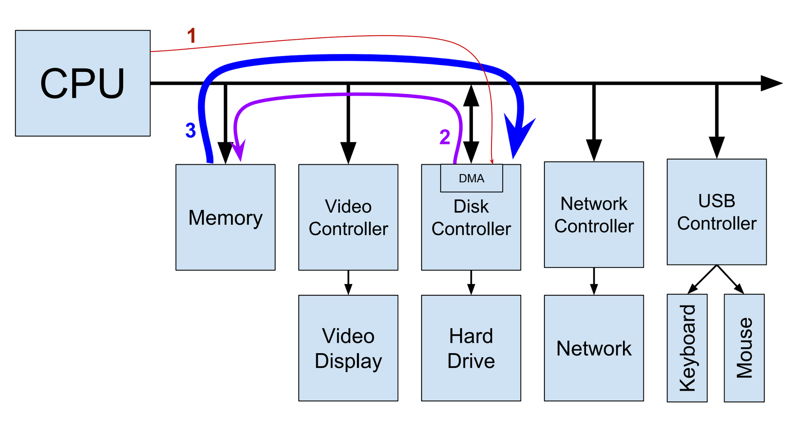

## Architettura del sistema

Le periferiche comunicano con il processore tramite *interrupts* al processore. Possiamo vedere quante volte il processore è stato interrotto da ogni periferica consultando il file `/proc/interrupts`. Come tutti i file nella cartella `/proc`, non è persistente e viene rigenerato al boot. 

Dentro il file `proc/ioports` vediamo per ogni dispositivo il suo univoco spazio in memoria. Una volta che il dispositivo ha mandato l'interrupt alla cpu questa deve mediare il trasfermento di dati fra la perifica e la memoria e lo scopo di questo file è fornire questo spazio in memoria, riservato dal driver della periferica al suo caricamento. Il file `/proc/dma` contiene la lista dei canali ISA DMA in uso, come i controller IDE, floppy e porte parallele. 

## Direct Memory Access

Normalmente, la CPU utilizza un bus per scambiare dati con le sue periferiche. Immaginiamo di dover passare dei dati al disco rigido. La CPU chiede alla ram i dati, la ram risponde e la cpu alla fine manda tutto al disco rigido. 



Questo spreca tempo della CPU e cicli del bus. Una periferica DMA (*direct memory access*) può leggere direttamente i dati senza tenere impegnata la CPU. L'unico dato che deve scambiare la cpu al controllere della periferica è su dove andare a prendere i dati. 



## Dispositivi e drivers

In un dispositivo UNIX esistono due tipi di dispositivi:
- *cold plug* sono quei dispositivi che devono venire collegati e scollegati soltanto a computer spento. Ad esempio, PCI cards, schede video, porte PCI.
- *hot plug* sono dispoitivi USB, firewire. Si possono collegare e scollegare a computer accesso.

Possiamo vedere un elenco dei dispositivi PCI collegati col comando `lspci`. L'opzione `-t` ce lo fa vedere con gerarchia. 

```
federico@FROFED-NB-DELL:~$ lspci
1ae0:00:00.0 SCSI storage controller: Red Hat, Inc. Virtio console (rev 01)
38dd:00:00.0 3D controller: Microsoft Corporation Device 008e
d099:00:00.0 System peripheral: Red Hat, Inc. Virtio file system (rev 01)
federico@FROFED-NB-DELL:~$ lspci -t
-+-[d099:00]---00.0
 +-[38dd:00]---00.0
 +-[1ae0:00]---00.0
 \-[0000:00]-
```

Dal kernel 2.6 i device vengono creati dinamicamente. Nella cartelle `/dev` ci sono tutti i device e il servizio `udev` si occupa di gestirli.