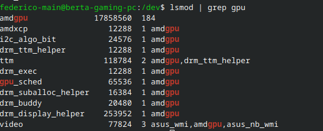

## Dispositivi e drivers

In un dispositivo UNIX esistono due tipi di dispositivi:
- *cold plug* sono quei dispositivi che devono venire collegati e scollegati soltanto a computer spento. Ad esempio, PCI cards, schede video, porte PCI.
- *hot plug* sono dispoitivi USB, firewire. Si possono collegare e scollegare a computer accesso.

Possiamo vedere un elenco dei dispositivi PCI collegati col comando `lspci`. L'opzione `-t` ce lo fa vedere con gerarchia. 

```
federico@FROFED-NB-DELL:~$ lspci
1ae0:00:00.0 SCSI storage controller: Red Hat, Inc. Virtio console (rev 01)
38dd:00:00.0 3D controller: Microsoft Corporation Device 008e
d099:00:00.0 System peripheral: Red Hat, Inc. Virtio file system (rev 01)
federico@FROFED-NB-DELL:~$ lspci -t
-+-[d099:00]---00.0
 +-[38dd:00]---00.0
 +-[1ae0:00]---00.0
 \-[0000:00]-
```

Dal kernel 2.6 i device vengono creati dinamicamente. Nella cartelle `/dev` ci sono tutti i device e il servizio `udev` si occupa di gestirli e crearli quando vengono collegati e rimossi quando necessario. Prova ad esempio a fare `ls /dev/sd?` prima e dopo aver collegato una chiavetta USB. Ogni dispositivo collegato ha sempre bisogno di un driver per funzionare, e possiamo vedere quelli caricati in memoria con `lsmod` Vediamo che ci mostra il nome del driver, lo spazio occupato in memoria, il numero di dispositivi collegati e se possibile quali sono. 



Se vediamo un driver senza dispositivi che lo utilizzino e vogliamo rimuoverlo dalla memoria possiamo usare il comando `rmmod <nome-driver>`. Nota bene che si intende rimuoverlo dalla ram, non dal filesystem. Se poi cambiamo idea possiamo sempre riattivarlo con `insmod /path/to/driver` e generalmente li troviamo in `/lib/modules/<versione-attuale-del-kernel>` (se non ce la ricordiamo, `uname -r`). Altrimenti, potremmo sempre usare `find`. Mettiamo caso che io abbia rimosso `pcspkr`:

```
federico-main@berta-gaming-pc:/dev$ find /lib/modules/$(uname -r)/ -iname "*pcspkr*"
/lib/modules/6.8.12-201.fsync.fc40.x86_64/kernel/drivers/input/misc/pcspkr.ko.xz
```
È comunque più semplice usare il comando `modprobe` che ci permette di evitare questo passaggio e fare `modprobe -r pcspkr` per rimuovere e `modprobe pcspkr` per ricaricare in memoria. Il vantaggio di `insmod` è però quello di permetterti di caricare un modulo da un percorso non necessariamente sotto `/lib/modules`.

Utenze e applicativi senza privilegi di root possono accedere all'hardware e alle sue proprietà indirettamente, tramite file system `sysfs`, montati dentro a `/sys`. All'interno di `/sys` abbiamo device divisi per categoria:

```
federico-main@berta-gaming-pc:/dev$ cd /sys
federico-main@berta-gaming-pc:/sys$ ll
total 0
drwxr-xr-x   2 root root 0 11 lug 08.34 block
drwxr-xr-x  46 root root 0 11 lug 08.34 bus
drwxr-xr-x  80 root root 0 11 lug 08.34 class
drwxr-xr-x   4 root root 0 11 lug 08.34 dev
drwxr-xr-x  24 root root 0 11 lug 08.34 devices
drwxr-xr-x   6 root root 0 11 lug 08.34 firmware
drwxr-xr-x   9 root root 0 11 lug 08.34 fs
drwxr-xr-x   2 root root 0 11 lug 08.34 hypervisor
drwxr-xr-x  17 root root 0 11 lug 08.34 kernel
drwxr-xr-x 243 root root 0 11 lug 08.34 module
drwxr-xr-x   3 root root 0 11 lug 08.34 power
```

### D-Bus

D-Bus è un message bus system e trasporta messagi. Fornisce un canale di comunicazione per permettere ai processi di dialogare. Crea un daemon per gli eventi e uno per ogni *User Login Session*, ossia per ogni utente e sessione attiva per permettere appunto alle applicazioni nello user space di scambiare messaggi. D-Bus fornisce anche un canale di comunicazione fra l'applicazione e l'hardware tramite HAL (*Hardware Abstraction Layer*) integrato dal 2010 con Udev. In ogni caso HAL/Udev fornisce un db real time sulle perferiche collegate e passa alle applicazioni una semplice API per le query.